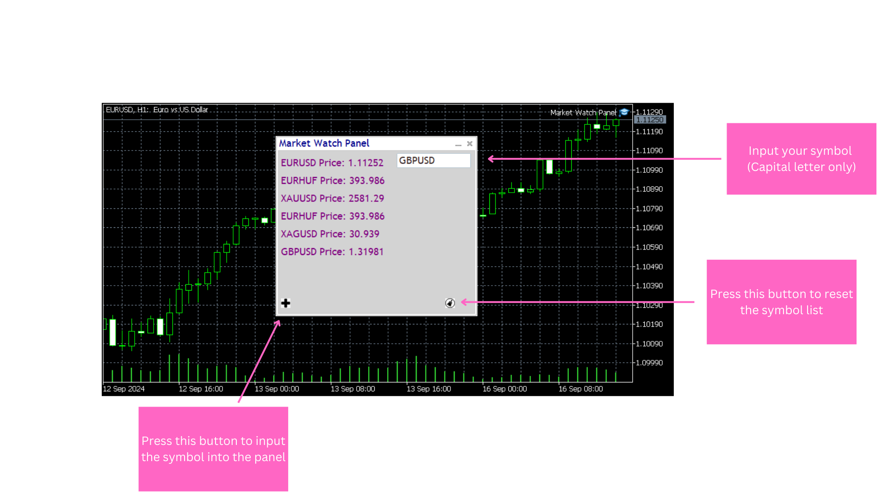

# The Market Watch Panel Utility

Here is an example of an image in this README:

The Market Watch Panel Utility provides real-time monitoring of financial symbols, displaying key data like close prices in a clean and intuitive interface. Designed for MetaTrader 5, this tool allows traders to quickly switch between symbols, stack multiple symbols, and filter the list for focused market analysis. It offers a streamlined, customizable trading experience, making it easy to track market movements and make informed decisions efficiently.

The utility also includes the ability to store symbols in a text file, ensuring that the panel loads with the saved symbols each time. Users can save, reset the symbol list, and even customize the panel’s appearance by changing text and window colors. It functions like a traditional market data window, offering a simple way to monitor symbol prices and stay updated.

Main Input:

Panel background color: Sets the background color of the entire panel (default: White).
Panel text color: Defines the color of the text displayed on the panel (default: DarkBlue).
Panel client background: Adjusts the background color of the client area within the panel (default: LightGray).
Panel main text color: Specifies the main text color within the panel (default: Purple).
